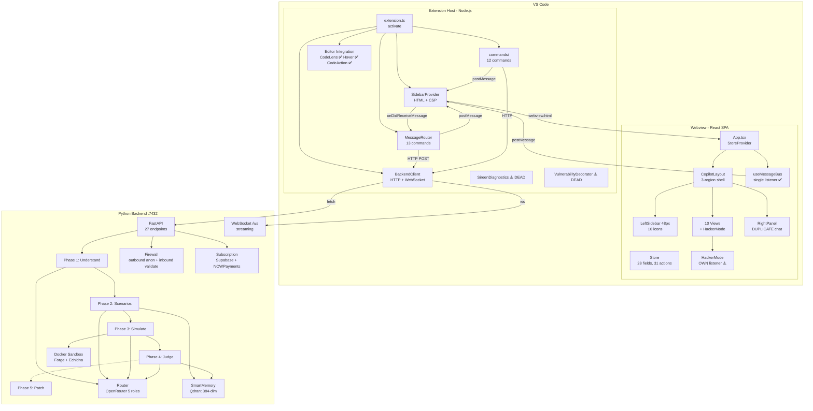
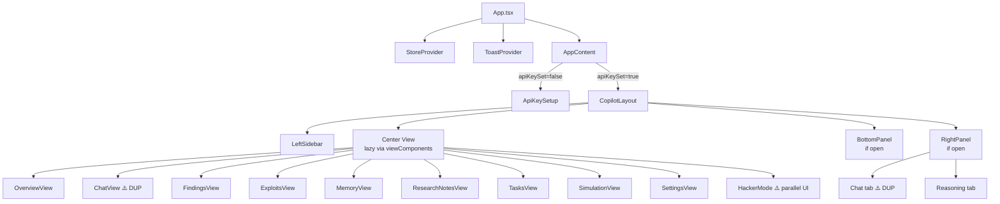
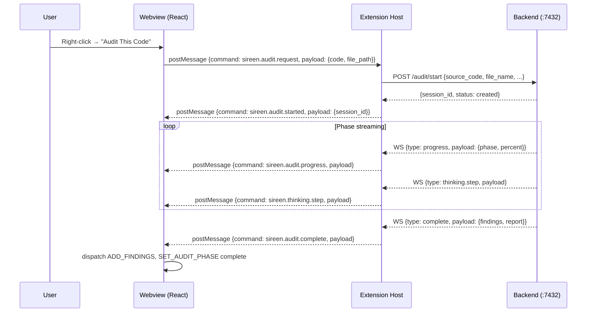
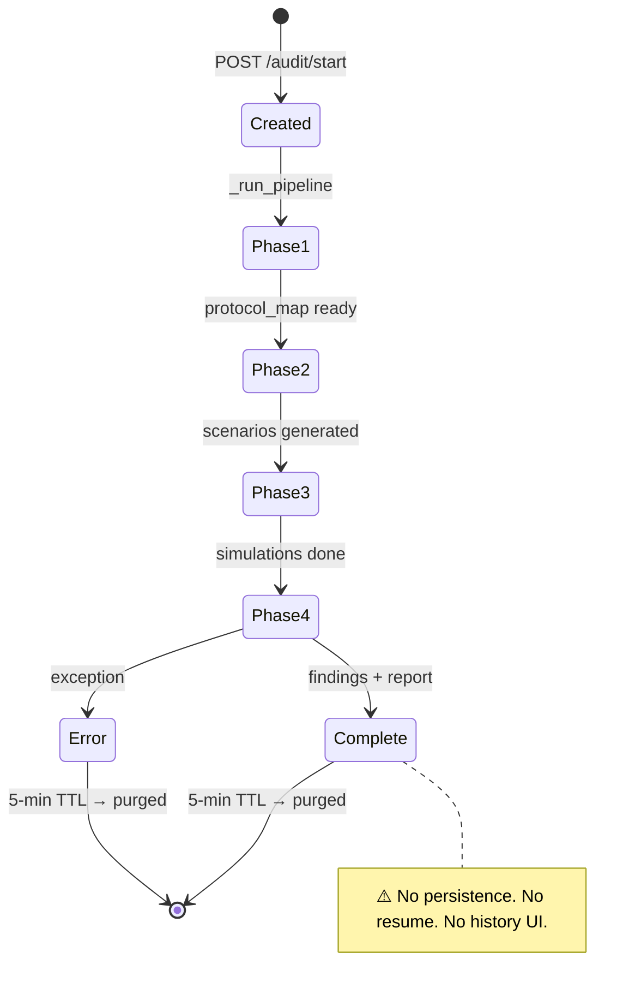

# SIREEN — Architecture & Product Final Review

> **Date:** 2026-08-10
> **Reviewers:** CEO, Principal Product Engineer, Principal Software Architect, Staff UX Designer, Principal Backend Engineer
> **Method:** Evidence-based. Every claim traced to source code. No redesign without justification.

---

## Executive Summary

SIREEN is a VS Code extension that turns smart-contract security auditing into an AI-guided, evidence-verified workflow. The backend is genuinely strong — a 4-phase audit pipeline with a 5-gate "Honest Signal" verification ladder, outbound code anonymization, and a real exploit-simulation engine. The frontend and product architecture, however, are **incoherent**: a website-style SPA with duplicate chat panels, a parallel HackerMode UI that ignores the design system, dead editor-integration code, and no session management despite the backend having a session entity.

**Verdict:** The backend is production-grade. The frontend is a prototype wearing a design-system coat. The product needs architectural consolidation — not more features.

---

## Part 1 — Product Vision & Personas

### Vision
SIREEN should be the tool a smart-contract auditor opens *before* they read the code. It should understand the protocol, hypothesize attacks, prove them with real Forge tests, and produce a bug-bounty report — all without leaving VS Code. The user's code is the hero; SIREEN is the expert sitting beside them.

### Personas

| Persona | Goal | What they need from SIREEN |
|---|---|---|
| **Protocol Engineer** (defensive) | "Is my contract safe?" | Fast audit, clear findings, one-click patches |
| **Security Researcher** (offensive) | "Can I break this?" | Attack hypotheses, PoC generation, Forge verification, money-flow analysis |
| **Bug-Bounty Hunter** | "Can I earn from this?" | Reproducible PoCs, severity scoring, Immunefi-format reports |
| **Audit Lead** (team) | "What did we audit and when?" | Session history, audit trail, report archive |

---

## Part 2 — User Journey (As-Is vs. Should-Be)

### As-Is (what a new user experiences today)

```
Open VS Code → Sireen icon in Activity Bar
  ↓
Click icon → Sidebar opens
  ↓
API Key Setup screen (if backend down or key not set)
  ↓
Enter key → Overview dashboard appears
  ↓
  ┌─ LeftSidebar (48px icon rail, 10 icons)
  ├─ Center: OverviewView (stat cards, "SIREEN" hero text)
  └─ RightPanel (chat panel, always open)
  ↓
Right-click a .sol file → "Audit This Code"
  ↓
Audit runs → progress bar fills → findings appear in FindingsView
  ↓
...but where did my previous audit go? (5-min TTL, gone)
...why are there two chat panels? (ChatView + RightPanel)
...what is "Attack Workspace"? (HackerMode, different design system)
...why no squiggles in my editor? (diagnostics never wired)
```

**Problems a user hits in the first 5 minutes:**
1. "What is this product?" — the Overview dashboard looks like a landing page, not a tool
2. "Where is my previous audit?" — sessions expire in 5 minutes, no history UI
3. "Which chat do I use?" — two chat panels exist simultaneously
4. "Why does Attack Workspace look different?" — HackerMode uses hardcoded hex, not the design system
5. "Why aren't findings in my editor?" — diagnostics and decorations are dead code

### Should-Be (session-first, one workspace)

```
Open VS Code → Sireen icon
  ↓
Session List (recent audits, resume/archive/create)
  ↓
Open/create session → Workspace loads with the contract
  ↓
  ┌─ Session header (name, status, project, timeline)
  ├─ Findings (tree, inline with editor squiggles)
  ├─ Chat (ONE panel, contextual to current finding)
  └─ Actions (audit, exploit, patch, report — inline, not pages)
  ↓
Audit → findings populate → click finding → editor jumps to line
  ↓
Exploit → PoC generates → Forge verifies → money flow shows
  ↓
Report → export → archived in session history
```

---

## Part 3 — Information Architecture Audit

### Current IA (10 pages + 1 parallel UI = 11 screens)

```
SIREEN (single webview, 48px custom sidebar)
├── Overview          (dashboard, stat cards, hero text)
├── Findings          (list page with search/filter)
├── Chat              (DUPLICATE #1 — full page chat)
├── Attack Workspace  (HackerMode — parallel UI, different design)
├── Exploits          (list of PoC panels)
├── Memory            (collection tabs + search)
├── Notes             (textarea)
├── Tasks             (todo list)
├── Simulation        (sandbox status + terminal)
├── Settings          (API key, RPC, connection)
└── [RightPanel]      (DUPLICATE #2 — persistent chat + reasoning)
```

**Violations:**
- 3 view IDs (`contracts`, `attackSurface`, `warRoom`) alias to OverviewView — ghost navigation
- `warRoom` is in `viewComponents` but NOT in the `ViewId` type — type mismatch
- Chat exists as both a page (`ChatView`) and a panel (`RightPanel`) — user doesn't know which to use
- HackerMode is a self-contained UI with its own message listener, its own state, its own components

### Proposed IA (session-centered, 3 zones)

```
SIREEN (single webview)
├── Session Bar       (top: active session name, status, switcher)
├── Main Zone         (contextual: Findings list / Chat / Exploit detail)
└── Action Bar        (bottom: Audit, Exploit, Patch, Report — contextual)
```

No custom sidebar. No 10 pages. One workspace that adapts to what the user is doing.

---

## Part 4 — Duplication Audit (Rule 5)

Every item below is proven from source:

### 4.1 Duplicate Chat Panels
| | `views/ChatView.tsx` | `layouts/RightPanel.tsx` |
|---|---|---|
| Renders | Full-page chat | Right-side chat tab |
| Reads | `chatMessages`, `isThinking`, `thinkingSteps` | Same |
| Sends | `sireen.chat.send`, `sireen.chat slash` | Same |
| Visible when | `activeView === 'chat'` | `rightPanelOpen === true` (default) |

**Impact:** User can see both simultaneously. Cognitive load: "which do I type in?"

### 4.2 Duplicate Message Listeners
- `useMessageBus()` — the single canonical listener (mounted once in `AppContent`)
- `HackerMode/index.tsx:96` — registers its OWN `window.addEventListener('message')`
- **Risk:** `exploitReady`, `sireen.exploit.started`, `sireen.exploit.complete` processed twice

### 4.3 Duplicate Command Paths
| Action | `commands/` (editor-triggered) | `MessageRouter` (webview-triggered) |
|---|---|---|
| Start audit | `gaolaif.auditSelection` → POST `/audit/start` | `sireen.audit.request` → POST `/audit/start` |
| Generate report | `gaolaif.generateReport` → POST `/report/generate` | `sireen.report.generate` → POST `/report/export` |
| Generate patch | `sireen.suggestPatch` → POST `/patch/generate` | `sireen.patch.request` → POST `/patch/generate` |
| Start sandbox | `gaolaif.runSandbox` → POST `/sandbox/start` | `sireen.sandbox.start` → POST `/sandbox/start` |

**Also:** `gaolaif.generateReport` and `sireen.generateReport` are two command IDs with the identical handler.

### 4.4 Duplicate Design Systems
- `ui/foundation/tokens.css` — maps `--sireen-*` to `--vscode-*` (the "new" system)
- `styles.css` — legacy aliases from old `--sireen-*` names to new tokens (compatibility shim)
- `HackerMode/index.tsx` — hardcoded hex (`#0D1117`, `#1E293B`, `#EF4444`) — ignores both

### 4.5 Dead Code (implemented, never wired)
| File | Status | Evidence |
|---|---|---|
| `decorations/vulnerabilityHighlight.ts` | Imported, never instantiated | `extension.ts:4` imports `VulnerabilityDecorator`; no `new VulnerabilityDecorator()` anywhere |
| `editor/sireenDiagnostics.ts` | `updateFindings()` never called | Created + disposed in `extension.ts`; no call site |
| `sandbox/echidna_runner.py` | Standalone, not wired into `main.py` | Utility function only |

---

## Part 5 — Session Model Audit (Rule 3)

### What exists
- **Backend:** `AuditSession` dataclass (`models/types.py:207`) — `session_id, source_code, language, file_path, file_name, protocol_map, scenarios, findings, status, error, warnings`
- **Backend storage:** in-memory dicts (`active_sessions`, `_completed_sessions`), 5-min TTL
- **Backend API:** `GET /sessions` (list), `GET /findings/{id}`, `GET /protocol-map/{id}`
- **Frontend:** `activeSessionId: string | null` in store, `SET_SESSION` action
- **Extension host:** nothing — forwards session IDs only

### What's missing (the gap)
| Capability | Backend | Frontend | Verdict |
|---|---|---|---|
| Create session | ✅ (on audit start) | ❌ (no UI) | User can't explicitly create |
| List sessions | ✅ `GET /sessions` | ❌ (no UI) | Previous audits invisible |
| Resume session | ⚠️ (within 5-min TTL) | ❌ | Lost after 5 minutes |
| Rename session | ❌ | ❌ | |
| Delete/archive | ❌ | ❌ | |
| Search/filter | ❌ | ❌ | |
| Export/import | ❌ | ❌ | |
| Session timeline | ❌ | ❌ | |
| Session → project link | ❌ | ❌ | |

**The session is the heart of the product (Rule 3), but it has no pulse.** The backend creates sessions on audit start, but the user has no way to see, resume, name, or manage them. After 5 minutes they vanish.

---

## Part 6 — Architecture Diagrams

### 6.1 System Architecture (As-Is)



### 6.2 Component Hierarchy (Frontend)



### 6.3 Audit Workflow (Backend Pipeline)

```mermaid
flowchart LR
    A[Source code<br/>+ file_path] -->|POST /audit/start| S[AuditSession<br/>created]
    S --> P1[Phase 1: Understand<br/>regex + LLM scanner]
    P1 -->|ProtocolMap| P2[Phase 2: Scenarios<br/>LLM attacker + heuristics]
    P2 -->|AttackScenario[]| P3[Phase 3: Simulate<br/>Forge test generation]
    P3 -->|SimulationProof| P4[Phase 4: Judge<br/>LLM judge + report]
    P4 -->|Finding[] + report| DONE[Session complete]
    DONE -.->|optional| P5[Phase 5: Patch<br/>LLM documenter]

    P1 -.->|anonymize| FW[OutboundFirewall]
    P2 -.->|query| MEM[SmartMemory]
    P3 --> SBX[Docker/Forge]
    P3 -.->|verify| HS[HonestSignal<br/>5-gate ladder]
    P4 -.->|save abstract| MEM
```

### 6.4 Message Flow (Webview ↔ Host ↔ Backend)



### 6.5 Session Lifecycle (Current — Broken)



---

## Part 7 — Complete Technical Documentation

### 7.1 Frontend Architecture

**Stack:** React 18 + TypeScript + Webpack 5 (no router, no external state library)

**State management:** Custom `StoreProvider` with `useReducer` + `vscode.getState()/setState()` persistence (500ms debounce). 28 fields, 31 actions.

**Routing:** None. `state.activeView` (a `ViewId` union) selects which lazy-loaded view renders in the center of `CopilotLayout`.

**Message bus:** `useMessageBus()` (single listener, mounted once) + `useSend()` (no listener, used by all leaf components). Correctly implements the single-listener invariant — **except** HackerMode registers its own second listener.

**Design system:** `ui/foundation/tokens.css` maps `--sireen-*` semantic tokens to `--vscode-*` theme variables. Primitives in `ui/primitives/` (Text, Stack, Flex, Grid, Icon), components in `ui/components/` (Button, Input, Card, Alert, etc.). HackerMode ignores all of this.

### 7.2 Backend Architecture

**Stack:** FastAPI + Uvicorn, Python 3.11, port 7432

**27 endpoints** (HTTP REST + 1 WebSocket). Dual-channel: HTTP for request/response, WebSocket for streaming (progress, phases, thinking, chat, exploit results).

**4-phase audit pipeline:**
1. **Understand** — regex extraction + LLM scanner → `ProtocolMap`
2. **Scenarios** — LLM attacker + heuristic fallback → `AttackScenario[]`
3. **Simulate** — Forge test generation + compilation (3 retries) + execution → `SimulationProof`
4. **Judge** — LLM judge + severity estimation + report generation → `Finding[]` + markdown report

**Honest Signal (5-gate verification):** PoC_Generated → Compiled → Executed → Exploit_Reproduced → Confirmed. Gate 4.5 rejects trivial assertions (`assertTrue(true)`). This is the core anti-false-positive engine.

**LLM:** OpenRouter free-tier, 5 roles (scanner/attacker/verifier/judge/documenter), synchronous `httpx.Client`, no streaming (wrapped in `asyncio.to_thread`).

**Memory:** Qdrant (384-dim `all-MiniLM-L6-v2`) with dict fallback. Zero-knowledge policy — raw code rejected, only abstract patterns saved.

**Firewall:** Outbound (anonymizes code before LLM call, deanonymizes results) + Inbound (validates LLM output structure, anti-hallucination).

**Subscription:** Supabase (user/quota) + NOWPayments (crypto, USDC on Polygon). Free tier: 2 findings/month. Hunter: $59/mo. Team: $349/mo. Gracefully disabled if env vars absent.

### 7.3 Extension Architecture

**Activation:** `onStartupFinished` + `onLanguage:solidity/move` + `workspaceContains:foundry.toml/Move.toml`

**Components:**
- `SidebarProvider` — generates HTML, registers message listener on every resolve
- `MessageRouter` — 13 inbound commands, 11 backend WS events forwarded to webview
- `BackendClient` — dual HTTP+WS, exponential backoff reconnection (10 attempts, 1s→30s)
- `commands/` — 12 VS Code commands (editor-triggered)
- `editor/` — CodeLens (Audit/Exploit/Ask per function), Hover, CodeAction (QuickFix)
- `decorations/` — VulnerabilityDecorator (DEAD — never instantiated)
- `editor/sireenDiagnostics` — DiagnosticCollection (DEAD — `updateFindings` never called)

**Backend startup:** `BackendClient.startBackend()` probes `/health` but never spawns the process. User must start the backend separately.

### 7.4 AI Architecture

```
User code → OutboundFirewall.anonymize → LLM (OpenRouter)
                                        ↓
                                    Phase 1: Scanner (gpt-oss-20b, temp 0.1)
                                    Phase 2: Attacker (nemotron-9b, temp 0.7)
                                    Phase 3: Verifier (nemotron-safety, temp 0.2)
                                    Phase 4: Judge (nemotron-9b, temp 0.3)
                                             Documenter (north-mini-code, temp 0.4)
                                        ↓
                                    InboundFirewall.verify
                                        ↓
                                    HonestSignal.verify (5 gates)
                                        ↓
                                    Finding[] (confirmed/needs_review)
```

All LLM calls are synchronous (`httpx.Client`, 120s timeout) but wrapped in `asyncio.to_thread` to avoid blocking the event loop. No streaming — the WebSocket "thinking" events are phase-boundary notifications, not token streams.

### 7.5 Database Architecture

**There is no database.** Everything is in-memory:
- Sessions: `active_sessions` + `_completed_sessions` dicts, 5-min TTL
- Memory: Qdrant (external, optional) or in-process dict
- Subscription: Supabase (external, optional) — user/quota tables
- No SQLite, no PostgreSQL, no persistent audit history

**This is the #1 architectural gap.** A product that sells audit sessions cannot lose them after 5 minutes.

### 7.6 State Management (Frontend)

| Category | Fields | Persisted? |
|---|---|---|
| Navigation | `activeView`, `rightPanelTab`, `rightPanelOpen`, `bottomPanelOpen`, `bottomPanelTab` | ✅ (except bottomPanelTab) |
| Session | `activeSessionId` | ❌ |
| Audit | `protocol`, `findings`, `findingsFilter`, `auditProgress`, `auditPhase`, `contractCode`, `contractFilePath` | ❌ (except findingsFilter) |
| Chat | `chatMessages`, `chatContext`, `isThinking`, `thinkingSteps` | ✅ (chatMessages only) |
| Exploits | `exploits`, `patchResult` | ❌ |
| Memory | `memoryEntries`, `memoryCollection` | ✅ (collection only) |
| Notes/Tasks | `researchNotes`, `tasks` | ✅ |
| Sandbox | `sandboxReady`, `simulationLog` | ❌ |
| Connection | `connectionStatus`, `apiKeySet` | ❌ |

### 7.7 API Map (Backend)

| Method | Path | Purpose |
|---|---|---|
| GET | `/health` | Status + `models_configured` |
| GET | `/models` | Available LLM models |
| GET | `/config/status` | API + forge + docker + qdrant availability |
| POST | `/config/set-key` | Write `OPENROUTER_API_KEY` to `.env` |
| POST | `/analyze` | Alias for audit start |
| POST | `/audit/start` | Start 4-phase audit (async) |
| POST | `/exploit/start` | Start single exploit (async) |
| POST | `/analyze/quick` | Phase-1 only (no LLM) |
| POST | `/analyze/function` | Single-function analysis |
| POST | `/explain` | NL code explanation |
| POST | `/chat` | REST conversational chat |
| WS | `/ws` | Streaming: analyze, exploit, chat, ping |
| POST | `/sandbox/start` | Start Docker sandbox |
| POST | `/sandbox/invariant` | Run invariant tests |
| POST | `/sandbox/fuzz` | Run fuzz tests |
| POST | `/memory/search` | Vector search |
| POST | `/memory/save` | Save abstract pattern |
| POST | `/patch/generate` | Phase 5 — remediation patch |
| POST | `/report/generate` | Markdown report from session |
| POST | `/report/export` | Export findings (md/json) |
| GET | `/findings/{session_id}` | Session findings |
| GET | `/protocol-map/{session_id}` | Phase 1 ProtocolMap |
| GET | `/sessions` | List active + recent sessions |
| GET | `/subscription/status` | Tier + quota |
| POST | `/subscription/upgrade` | Create payment invoice |
| POST | `/payment/webhook` | NOWPayments IPN receiver |

### 7.8 Environment Variables

| Variable | Required | Purpose |
|---|---|---|
| `OPENROUTER_API_KEY` | ✅ | LLM access (free-tier models) |
| `QDRANT_HOST` | ❌ | Vector memory (defaults to localhost) |
| `QDRANT_PORT` | ❌ | Defaults to 6333 |
| `QDRANT_API_KEY` | ❌ | Cloud Qdrant auth |
| `SUPABASE_URL` | ❌ | Subscription system |
| `SUPABASE_SERVICE_ROLE_KEY` | ❌ | Subscription system |
| `NOWPAYMENTS_API_KEY` | ❌ | Crypto payments |
| `NOWPAYMENTS_IPN_SECRET` | ❌ | Payment webhook verification |
| `SIREEN_BACKEND_URL` | ❌ | Payment callback URL |

### 7.9 Build Process

**Extension:**
```
npm run compile    → webpack (dev)
npm run package    → webpack --mode production --devtool hidden-source-map
npm run watch      → webpack --watch
npm test           → jest
npx tsc --noEmit   → type check
npm run lint       → eslint
```

**Backend:**
```
python -m uvicorn main:app --host 127.0.0.1 --port 7432
python -m pytest tests/ -v
docker-compose -f docker-compose.prod.yml up
```

### 7.10 Testing Strategy

| Layer | Tool | Count | Status |
|---|---|---|---|
| TypeScript types | `tsc --noEmit` | — | ✅ 0 errors |
| Lint | ESLint | 22 warnings | ✅ 0 errors |
| Extension unit | Jest | 7 suites, 38 tests | ✅ all pass |
| Backend unit | Pytest | 72 tests | ✅ all pass (352s) |
| Integration | — | — | ❌ none |
| E2E | `test_e2e_mvp.py` | exists | ⚠️ requires live backend |
| Accessibility | — | — | ❌ none |
| Performance | — | — | ❌ none |

---

## Part 8 — Product Decisions (Rule 6)

### Decision 1: Remove `ChatView` (the page), keep `RightPanel` (the panel)
**Why:** Two chat UIs with identical message contracts confuse users. The RightPanel is contextual (visible alongside findings); the ChatView is a full-page replacement that hides everything else.
**User problem solved:** "Which chat do I use?"
**Cognitive load:** Reduced from 2 chat surfaces to 1.

### Decision 2: Delete HackerMode, migrate its capabilities into the main design system
**Why:** HackerMode is a parallel UI with its own listener, its own state, hardcoded hex colors, and legacy components. It violates every design-system rule. Its capabilities (exploit idea input, PoC result, money flow, agent log) should be components in `ui/components/` rendered in the main workspace.
**User problem solved:** "Why does Attack Workspace look different from everything else?"
**Cognitive load:** One visual language, not two.

### Decision 3: Wire diagnostics and decorations
**Why:** `VulnerabilityDecorator` and `SireenDiagnostics.updateFindings` are fully implemented but never called. Findings should appear as editor squiggles + line decorations — that's where the user's code is.
**User problem solved:** "Why aren't findings in my editor?"
**Productivity:** Click finding → editor jumps to line → squiggle shows severity. No context switch to sidebar.

### Decision 4: Add session persistence (SQLite)
**Why:** Sessions expire in 5 minutes. A bug-bounty hunter who runs an audit, gets distracted, and comes back in 10 minutes loses everything. This is unacceptable for a paid product.
**User problem solved:** "Where did my audit go?"
**Productivity:** Resume any audit, ever.

### Decision 5: Remove the 48px custom sidebar
**Why:** VS Code's Activity Bar already provides navigation. A custom 48px icon rail with 10 buttons duplicates the Activity Bar's purpose and wastes horizontal space in a sidebar that's already narrow.
**User problem solved:** "Why are there two sidebars?"
**Cognitive load:** One navigation system, not two.

### Decision 6: Consolidate command paths
**Why:** `commands/` and `MessageRouter` duplicate audit/exploit/patch/report/sandbox logic with different payload shapes and different endpoints (`/report/generate` vs `/report/export`). This is a maintenance hazard.
**User problem solved:** Indirect — fewer bugs, faster fixes.
**Productivity:** One code path per action.

---

## Part 9 — Validation Results

| Gate | Command | Result |
|---|---|---|
| TypeScript | `npx tsc --noEmit` | ✅ 0 errors |
| ESLint | `npm run lint` | ✅ 0 errors, 22 warnings (`no-explicit-any`) |
| Extension tests | `npm test` | ✅ 7 suites, 38 tests pass |
| Backend tests | `python -m pytest tests/` | ✅ 72 tests pass |
| Build | `npm run package` | ✅ `dist/extension.js` (68 KB) + `dist/webview.js` (324 KB) |
| Backend health | `GET /health` | ✅ `models_configured=True` |
| Extension activation | exthost.log | ✅ `Hussein-M.sireen` activated, webview created |
| Integration tests | — | ❌ none exist |
| E2E tests | — | ⚠️ `test_e2e_mvp.py` exists but requires live backend + forge |
| Accessibility | — | ❌ none |
| Performance | — | ❌ none |

---

## Part 10 — Future Scalability Plan

### Phase A: Consolidation (no new features)
1. Delete `ChatView.tsx` — keep `RightPanel` as the single chat surface
2. Delete `HackerMode/index.tsx` — port capabilities to `ui/components/` in the design system
3. Wire `SireenDiagnostics.updateFindings` + instantiate `VulnerabilityDecorator`
4. Remove `warRoom`, `contracts`, `attackSurface` ghost views from `viewComponents` and `ViewId`
5. Consolidate `gaolaif.generateReport` + `sireen.generateReport` → one command
6. Remove `exploitWithIdea` legacy command — use `sireen.exploit.request`

### Phase B: Session persistence
1. Add SQLite (`sessions.db`) to backend — persist `AuditSession` on completion
2. Add `GET /sessions?limit=50&status=all` — list all, not just active
3. Add `PATCH /sessions/{id}` — rename
4. Add `DELETE /sessions/{id}` — delete
5. Frontend: Session List view, session switcher in header

### Phase C: Native VS Code integration (per REDESIGN.md)
1. Add Tree Views for Findings + Exploits (native, themeable, draggable)
2. Reduce webview to chat-only
3. Status Bar items for connection + audit progress
4. Welcome View for empty state

### Phase D: AI improvements
1. Token streaming (replace synchronous `httpx` with streaming)
2. Multi-model routing (let user pick model per role)
3. Conversation memory across sessions (link SmartMemory to SQLite sessions)

---

## Final Verdict

SIREEN's backend is a well-engineered security pipeline with genuine anti-false-positive verification. The frontend is an unresolved prototype: two chat panels, a parallel UI, dead editor integration, and no session management. The product cannot be sold in its current state — not because it lacks features, but because it lacks **coherence**.

**The path forward is subtraction, not addition.** Remove the duplication, wire the dead code, persist the sessions, and let the backend's strength shine through a single, clear workspace.
